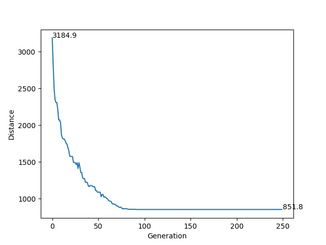

# GeneticAlg
This library is my personal introduction to evolutionary algorithms and typing in Python. The problem and most of the code are extended [from this tutorial by Eric Stoltz.](https://towardsdatascience.com/evolution-of-a-salesman-a-complete-genetic-algorithm-tutorial-for-python-6fe5d2b3ca35)

Note that is was done in Python 3.6, so the class annotation will not use `from __future__ import annotations`.

## Tests & Examples
Tests for this repository are in the file GA_tests.py. Uncomment the tests to see the output of the code at various points in the algorithm.

  

(i.) The best individual's fitness from each generation.    (ii.) The route taken by the most fit individual for each generation.

## Future Things to Try
- Try different fitness functions other than inverse to see if algorithm converges faster/better, e.g. squaring, different integer